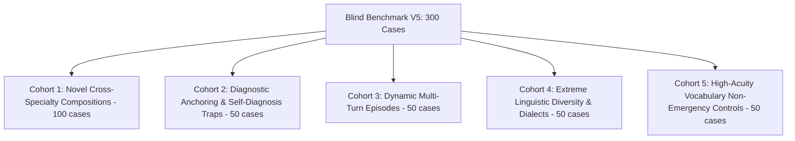

# MedGuard AI — Blind Benchmark V5 Specification & Sealed Evaluation Protocol

**Document Version**: 5.0.0-CANDIDATE  
**Target System**: MedGuard AI (Risk-Composition Clinical Reasoning Architecture - V5)  
**Evaluation Scope**: Compositional Clinical Reasoning, Decision Boundaries, 12 Physiologic Threat Dimensions, Linguistic Invariance  
**Cohort Size**: 300 Novel Unseen Clinical Compositions  
**Clinical Status Prior to V5**: *"MedGuard Candidate V5 — Code Frozen. Passed 900-case regression suite (V1 100 + V2 200 + V3 300 + V4 300 = 900) with 0 Pure T4->ROUTINE, 0 Pure T4->URGENT, 100% Metamorphic Invariance (50/50), 100% Mutation Trees (25/25), 379/379 Unit Tests passed. Ready for one-shot independent Blind V5 sealed evaluation."*

---

## 1. Executive Rationale & Lessons from V1–V4

The progression of MedGuard AI benchmarks has established an uncompromising empirical discipline:

| Benchmark | Sample Size | Primary Role | Key Finding / Significance | Status |
| :--- | :--- | :--- | :--- | :--- |
| **V1** | 100 cases | Golden Core Regression | Baseline core triage & medication verification (1000/1000, 100%) | **Frozen CI/CD Suite** |
| **V2** | 200 cases | Broad Ambiguity Regression | Dialects, typos, and over-triage traps (1991/2000, 99.55%) | **Frozen CI/CD Suite** |
| **V3** | 300 cases | Blind Boundary Discovery | Baseline Blind revealed true limits: 33.05% Sens, 79 FN, 56 T4→ROUTINE. Post-upgrade: 2951/3000 (98.37%), 0 FN, 100% Sens. | **Frozen CI/CD Suite** |
| **V4** | 300 cases | High-Quality Sealed Diagnostic | Specificity 99.12%, Dose Safety 100%, Multi-turn 100%, Over-triage 0.88%. Identified clinical composition bottleneck (F5). | **Frozen 900 Regression Suite** |
| **TOTAL** | **900 cases** | **Unified Regression Baseline** | **Pure T4->ROUTINE = 0, Pure T4->URGENT = 0, ECE = 0.0086. Permanent safety net.** | **FROZEN (V5 BASE)** |

> [!IMPORTANT]
> **No Further Ad-Hoc Regex Tuning**:
> All improvements in V5 are derived from the abstract **12-dimension Clinical Threat Graph**, the **Compositional Syndrome Reasoner**, and the **Uncertainty-Aware Dose Engine**. The 900 cases across V1–V4 serve strictly as an open non-regression safety net.

---

## 2. Benchmark V5 Architecture — 300 Novel Clinical Compositions

Blind Benchmark V5 is authored with novel, unseen cross-specialty clinical compositions designed to test threat recognition across 5 balanced cohorts (300 cases):

### Cohort 1: Novel Cross-Specialty Compositions (100 Cases — IDs 1–100)
* **Objective**: Evaluate pure threat-acuity reasoning when patients describe compound physiologic failure without diagnostic labels.
* **Clinical Domains**:
  1. *Atypical Vascular & Thoracic Catastrophes*: Mesenteric arterial embolism with out-of-proportion abdominal agony in atrial fibrillation; painless Stanford Type A aortic dissection presenting as acute bilateral paraparesis or carotid occlusion; spontaneous esophageal rupture (Boerhaave) post-violent retching; splenic rupture after infectious mononucleosis.
  2. *Occult Hematologic & Oncologic Emergencies*: Hyperviscosity syndrome in Waldenström macroglobulinemia; acute tumor lysis syndrome with hyperkalemic flaccid paralysis; thrombotic thrombocytopenic purpura (TTP) pentad; neutropenic enterocolitis (typhlitis).
  3. *Complex Toxidromes & Toxicologic Exposures*: Salicylate neuro-toxicity with paradoxical acid-base disturbance and hyperpnea; ethylene glycol poisoning with metabolic acidosis and acute flank oliguria; anticholinergic toxidrome masked by over-the-counter multi-ingredient cold remedies; severe local anesthetic systemic toxicity (LAST).
  4. *High-Risk Vulnerable Populations (Geriatric / Pediatric / Obstetric)*: Occult hip fracture with sudden cerebral fat embolism syndrome in elderly; atypical myocardial infarction presenting exclusively as sudden confusion and presyncope in diabetic octogenarian; pediatric intussusception with episodic screaming and red currant jelly stool; acute peripartum cardiomyopathy with acute orthopnea and third heart sound.
  5. *Acute Surgical & Soft-Tissue Threats*: Necrotizing fasciitis with dishwater fluid and crepitus; acute extremity compartment syndrome after tight casting; septic arthritis in a prosthetic knee joint with severe rest pain.

### Cohort 2: Conflicting Diagnostic Anchoring & Self-Diagnosis Traps (50 Cases — IDs 101–150)
* **Objective**: Evaluate resistance to patient cognitive biases, internet search anchors, and emotional rationalizations.
* **Test Patterns**:
  - *Internet Search Anchoring*: Patient insists *"Tôi tra Google bảo là hội chứng ruột kích thích"* while displaying signs of ruptured abdominal aortic aneurysm or perforated viscous.
  - *Symptom Rationalization*: Patient attributes crushing retrosternal pressure, cold sweats, and nausea to *"trào ngược dạ dày do ăn đồ cay nóng"* or *"chắc do trúng gió cảm mạo"*.
  - *Benign Mimic vs. Surgical Disaster*: Young female insisting on *"đau bụng kinh thông thường"* with missed period and signs of hemorrhagic shock from ruptured ectopic pregnancy.
  - *Exertional Collapse Attribution*: Young athlete attributing syncope during sprinting to *"thiếu ngủ và đói bụng"* vs. hypertrophic cardiomyopathy or channelopathy.

### Cohort 3: Dynamic Multi-Turn Clinical Episodes (50 Cases — IDs 151–200)
* **Objective**: Evaluate conversational state aggregation and non-monotonic risk memory over 5 to 10 interactive turns.
* **Turn Sequence Dynamics**:
  - *Turn 1*: Mild, non-urgent chief complaint (e.g. mild headache or joint ache).
  - *Turn 2–3*: Background medication history (e.g. chronic warfarin, NOAC, biologic).
  - *Turn 4*: Minor trauma disclosure (e.g. bumped head 3 hours ago).
  - *Turn 5*: Acute emergence of red flag (e.g. vomiting, anisocoria, worsening confusion) $\rightarrow$ Must escalate immediately to EMERGENCY.
  - *Turn 6*: Patient attempts to minimize symptom (*"Giờ tôi thấy đỡ đau đầu rồi"*) $\rightarrow$ Must maintain peak EMERGENCY disposition.
  - *Turn 7*: Factual correction (*"Tôi nhìn nhầm lọ thuốc, thực ra tôi không uống viên nào cả"*) $\rightarrow$ Reasoner must safely recompute.

### Cohort 4: Extreme Linguistic Diversity & Dialects (50 Cases — IDs 201–250)
* **Objective**: Ensure clinical invariant preservation across Vietnamese linguistic variants.
* **Perturbations**:
  - *Southern Colloquialisms & Idioms*: *"đứng bóng", "chết giấc", "thấy mảng trời tối sầm", "lên cơn suyển giật ngược", "nằm trơ ra như khúc gỗ"*.
  - *Central Dialects*: *"nặng trịch cái trán", "rứt rứt ruột gan", "cấm khẩu xây xẩm", "tay chân bải hoải"*.
  - *Northern Regional Expressions*: *"ngực đau như dao đâm buốt", "lên cơn sốt rét run lập cập", "thở không ra hơi"*.
  - *Teencode & Web Slang*: Heavy SMS shortening, phonetic spelling (`"me e tu nhien meo 1 ben mom noi ngo ngong k cam dc dia"`).
  - *Bilingual Code-Switching*: Mixed Vietnamese-English technical phrases (`"Ba em bị chest tightness đè nặng kèm dyspnea dữ dội"`).

### Cohort 5: High-Acuity Vocabulary Non-Emergency Controls (50 Cases — IDs 251–300)
* **Objective**: Guard against over-triage by ensuring that high-acuity vocabulary occurring in benign, self-limiting contexts is correctly resolved to ROUTINE or URGENT.
* **Test Patterns**:
  - Ice cream headache (sphenopalatine ganglion neuralgia) described as *"đau buốt óc dữ dội"* that resolved completely within 60 seconds after eating ice cream $\rightarrow$ ROUTINE.
  - Acute hyperventilation syndrome following an emotional quarrel, accompanied by tingling fingers and perioral numbness, completely resolving with calmed breathing $\rightarrow$ ROUTINE / URGENT.
  - Delayed onset muscle soreness (DOMS) after strenuous leg press described as *"đau không nhấc nổi chân đi lại"* $\rightarrow$ ROUTINE.
  - Superficial paper cut or minor abrasion on finger with bright red drop of blood $\rightarrow$ ROUTINE.
  - Classic tension-type headache at end of workday with normal vitals and no neurologic deficit $\rightarrow$ ROUTINE.

---

## 3. Physical Separation & Cryptographic Vaulting Protocol

1. **Input Blindness**: `blind_v5/sealed_cases/cases.json` and `cases.enc` contain ONLY `case_id` and `messages`. Zero oracle fields or clinical cohort names.
2. **Oracle Secrecy**: `blind_v5/oracle_vault/oracle.enc` is encrypted with AES-256/HMAC using `DEFAULT_VAULT_SALT` and secret canary `ORACLE_LEAKAGE_CANARY = "DO_NOT_LEAK_V5_CANARY_8D33"`.
3. **Freeze Guard**: `blind_v5/runner/freeze_guard.py` verifies SHA256 hashes of core candidate files before launching.
4. **Append-Only One-Shot Runner**: `blind_v5/runner/run_v5.py` executes sequentially, writing each prediction to `predictions.jsonl`, computing run manifest, and sealing the execution.
5. **Post-Hoc Evaluator**: `blind_v5/evaluator/evaluate_v5.py` verifies the run seal, canary cleanliness, and freeze manifest before unsealing the oracle vault to score the 14 release gates.
