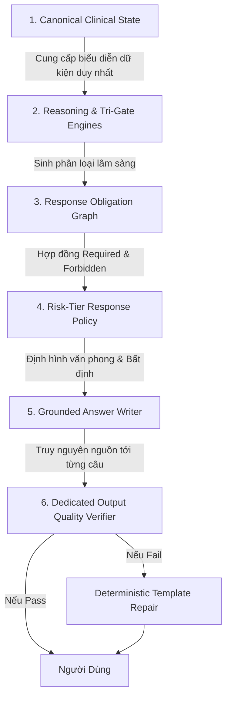
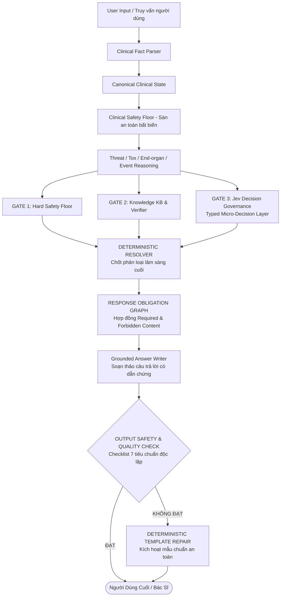

# BÁO CÁO TIẾN ĐỘ THỰC HIỆN ĐỀ TÀI GIỮA KỲ
## HỆ THỐNG AI Y TẾ ĐA TÁC NHÂN HỖ TRỢ PHÂN LUỒNG LÂM SÀNG, BÓC TÁCH ĐƠN THUỐC VÀ AN TOÀN SỬ DỤNG THUỐC (MEDGUARD AI)
### Phiên Bản Nâng Cấp: Kiểm Soát Toàn Diện Trạng Thái Lâm Sàng Và Chất Lượng Câu Trả Lời Đầu Ra
*MedGuard AI: Multi-Agent Clinical Triage, Prescription OCR and Output-Governed Medication Safety System*

---

> **📌 THÔNG TIN HỌC PHẦN & ĐÁNH GIÁ TIẾN ĐỘ**
> - **Cấp độ đồ án:** Đồ án Tốt nghiệp / Đồ án Chuyên ngành Công nghệ Thông tin (Capstone Project)
> - **Thời điểm báo cáo:** Tháng 09/2026 (Mốc đánh giá tiến độ giữa kỳ — Bản cập nhật kiến trúc V11)
> - **Nhóm sinh viên thực hiện:** Nhóm MedGuard AI (Nhóm trưởng: `munonguyen`)
> - **Hệ thống khách hàng tham chiếu:** Nền tảng Chăm sóc Y tế BookingCare (BookingCare Web Platform)
> - **File tài liệu Word chính thức:** [`BAO_CAO_TIEN_DO_GIUA_KY_MEDGUARD_AI.docx`](file:///Users/munonguyen/Project%20ATI/BAO_CAO_TIEN_DO_GIUA_KY_MEDGUARD_AI.docx)

---

## MỤC LỤC BÁO CÁO

1. [Phần 1: Thông Tin Đề Tài Và Phân Công Thành Viên](#phần-1-thông-tin-đề-tài-và-phân-công-thành-viên)
2. [Phần 2: Overview — Đánh Giá Hiện Trạng & Nhận Diện Nút Thắt Chất Lượng Đầu Ra](#phần-2-overview--đánh-giá-hiện-trạng--nhận-diện-nút-thắt-chất-lượng-đầu-ra)
3. [Phần 3: Problems And Objectives — Vấn Đề Và Mục Tiêu Nâng Cấp](#phần-3-problems-and-objectives--vấn-đề-và-mục-tiêu-nâng-cấp)
4. [Phần 4: Technical Approaches — 6 Lớp Cải Tiến Đột Phá & Phương Pháp Luận Cốt Lõi](#phần-4-technical-approaches--6-lớp-cải-tiến-đột-phá--phương-pháp-luận-cốt-lõi)
5. [Phần 5: System Design — Thiết Kế Hệ Thống & Luồng Suy Luận Tái Cấu Trúc](#phần-5-system-design--thiết-kế-hệ-thống--luồng-suy-luận-tái-cấu-trúc)
6. [Phần 6: Development Plan — Kế Hoạch 15 Tuần & Lộ Trình Candidate V11](#phần-6-development-plan--kế-hoạch-15-tuần--lộ-trình-candidate-v11)
7. [Phần 7: Progress — Tiến Độ Hiện Tại & Thiết Lập Bộ Response Quality Benchmark](#phần-7-progress--tiến-độ-hiện-tại--thiết-lập-bộ-response-quality-benchmark)
8. [Phần 8: AI Disclosure — Minh Bạch Sử Dụng Trí Tuệ Nhân Tạo](#phần-8-ai-disclosure--minh-bạch-sử-dụng-trí-tuệ-nhân-tạo)

---

## PHẦN 1: THÔNG TIN ĐỀ TÀI VÀ PHÂN CÔNG THÀNH VIÊN

### 1.1 Tên Đề Tài Chính Thức
- **Tên tiếng Việt:** HỆ THỐNG AI Y TẾ ĐA TÁC NHÂN HỖ TRỢ PHÂN LUỒNG LÂM SÀNG, BÓC TÁCH ĐƠN THUỐC VÀ AN TOÀN SỬ DỤNG THUỐC
- **Tên tiếng Anh:** MedGuard AI: An Independent Multi-Agent Clinical Triage, Prescription OCR and Output-Governed Medication Safety System
- **Tên mã phát triển (Working Codename):** `MedGuard AI` (Kiến trúc vi dịch vụ độc lập v2.0 — Lõi Candidate V11)
- **Hệ thống đối tác tham chiếu đầu tiên:** Nền tảng Đặt khám & Chăm sóc Y tế BookingCare (BookingCare Web Platform)

### 1.2 Danh Sách Thành Viên Nhóm & Phân Công Nhiệm Vụ

| STT | Họ và Tên | Mã Sinh Viên | Vai Trò trong Nhóm | Nhiệm Vụ Cụ Thể Phụ Trách | Đóng Góp |
|:---:|---|:---:|---|---|:---:|
| 1 | **Nguyễn Mậu Nhật Nam** (`munonguyen`) | *[Điền MSSV]* | **Nhóm trưởng / Tech Lead** | • Kiến trúc sư trưởng hệ thống; thiết kế Canonical Clinical State, Clinical Safety Floor, Jev Decision Governance.<br>• Backend FastAPI Gateway & Bảo mật Multi-tenant PostgreSQL RLS.<br>• Điều phối chu kỳ kiểm định độc lập Blind V8, Blind V10 và kiến trúc nâng cấp V11. | **35%** |
| 2 | **Lê Hoàng Long** | *[Điền MSSV]* | **Frontend & Fullstack Engineer** | • Phát triển Clinical Workspace SPA trên React 19 + Vite.<br>• Thiết kế UX đàm thoại lâm sàng tự nhiên, quét mã QR/vạch dược phẩm.<br>• Tích hợp API Gateway, quản lý trạng thái lịch nhắc thuốc.<br>• Xây dựng bộ kiểm thử giao diện tự động UI Smoke Tests (Playwright). | **25%** |
| 3 | **Trần Thị Mai Anh** | *[Điền MSSV]* | **Clinical Data & Knowledge Engineer** | • Chuẩn hóa Cơ sở tri thức y khoa (JSON Knowledge Base) theo Dược thư QG VN.<br>• Thiết lập Response Obligation Graph, ma trận dị ứng chéo 7 nhóm, 10 cặp tương tác, 7 mẫu cờ đỏ ESI.<br>• Xây dựng quy trình đồng thuận 3 bên (Tri-Party Consensus) gán nhãn tập đối soát. | **20%** |
| 4 | **Phạm Quốc Dũng** | *[Điền MSSV]* | **AI Vision & Pipeline Engineer** | • Triển khai Pipeline bóc tách đơn thuốc OCR (PaddleOCR, VietOCR).<br>• Xây dựng Response Quality Verifier và bộ benchmark chất lượng câu trả lời 500 ca.<br>• Quản lý kho hồi quy lịch sử 2.700 ca và công cụ niêm phong mã băm HMAC. | **20%** |

---

## PHẦN 2: OVERVIEW — ĐÁNH GIÁ HIỆN TRẠNG & NHẬN DIỆN NÚT THẮT CHẤT LƯỢNG ĐẦU RA

### 2.1 Kiến Trúc Hiện Tại Mạnh Ở Đâu? (System Completeness: 9/10)
Ở cấp độ kỹ thuật hệ thống, MedGuard AI đã đạt độ hoàn thiện cao, thể hiện sự am hiểu sâu sắc về an toàn y tế và kỹ nghệ phần mềm với **5 khối kiến trúc rất tốt**:
1. **Safety before generation:** Sàn an toàn lâm sàng (*Clinical Safety Floor*) kết hợp *Deterministic Rule Engine* giúp quyết định mức độ khẩn cấp và nguy cơ dược lý tuyệt đối không phụ thuộc vào LLM.
2. **Independent verification:** Answer Agent và Verifier Agent được phân tách vai trò độc lập, không cho phép mô hình tự duyệt kết quả của chính mình.
3. **Human-in-the-loop (HITL):** Mọi kết quả bóc tách đơn thuốc OCR và rà soát thuốc nguy cơ cao đều mang trạng thái bắt buộc `PENDING_REVIEW`, chuyển Dược sĩ/Bác sĩ xác nhận.
4. **Auditability & Traceability:** Cơ sở tri thức có phiên bản, mã băm SHA-256 truy vết, nhật ký kiểm toán bất biến (*immutable audit event*), hạ tầng cách ly đa người thuê (*PostgreSQL RLS*).
5. **Honest evaluation:** Nhóm không chỉ nhìn vào các tập huấn luyện/hồi quy đẹp đẽ mà đã xây dựng giao thức kiểm định độc lập mù (*Blind V10 One-Shot* trên 300 ca unseen niêm phong) và công bố minh bạch kết quả 4/14 gates đạt.

### 2.2 Điểm Nghẽn Mới: Tầng Kiểm Soát Chất Lượng Câu Trả Lời Đầu Ra Sau Suy Luận
Tuy nhiên, nếu mục tiêu cuối cùng là **chất lượng câu trả lời thực tế mà người bệnh và nhân viên y tế đọc được**, kiến trúc hiện tại chưa thể coi là hoàn thiện:
- Bộ hồi quy 2.400 ca đạt 100% độ nhạy, nhưng trên tập unseen Blind V10 độ nhạy chỉ đạt 93.02% và việc phát hành lâm sàng vẫn bị khóa (*Release Blocked*).
- **Điểm thiếu lớn nhất không còn là "thêm mô hình AI"**, mà là **tầng kiểm soát chất lượng đầu ra sau reasoning**.
- Minh chứng rõ nét nhất: Tại Gate B10-G10 (Dual crisis), 35/35 ca đều được phân loại cấp cứu chính xác ở tầng reasoning, nhưng hàm tạo văn bản (`build_grounded_answer`) lại vô tình format đè và làm mất số hotline hỗ trợ khủng hoảng tâm lý. Đây chính là loại lỗi nguy hiểm: **Reasoning đúng nhưng Output vẫn sai!**

---

## PHẦN 3: PROBLEMS AND OBJECTIVES — VẤN ĐỀ VÀ MỤC TIÊU NÂNG CẤP

### 3.1 4 Vấn Đề Cốt Lõi Được Nhận Diện
1. **Phân mảnh trạng thái lâm sàng (Fragmented Clinical State):** Các Gate và module nhận dữ liệu theo các định dạng khác nhau. Gate 1 hiểu một nghĩa, Gate 2 hiểu nghĩa khác, Jev nhận state thiếu, và tầng viết văn lại diễn giải theo cách thứ tư.
2. **Thiếu đồ thị ràng buộc nội dung (Lack of Response Obligations):** Hệ thống chỉ chuyển nhãn `triage = EMERGENCY` xuống mà không kèm theo hợp đồng quy định nội dung bắt buộc phải có (`required_content`) và nội dung bị cấm (`forbidden_content`).
3. **Thiếu bộ thẩm định chất lượng câu trả lời riêng (Dedicated Output Quality Verifier):** Verifier hiện tại thiên về kiểm tra trích dẫn tài liệu, thiếu bộ checklist độc lập đo lường câu trả lời cuối cùng người dùng đọc được.
4. **Không phân rã độ bất định (Conflated Uncertainty):** Gộp chung một độ tin cậy duy nhất, không tách biệt giữa độ tin cậy phân luồng cấp cứu (*triage confidence*) và độ tin cậy chẩn đoán bệnh lý (*diagnostic confidence*).

### 3.2 Mục Tiêu Nâng Cấp Định Lượng Của Hệ Thống

| Nhóm Mục Tiêu | Chỉ Tiêu Định Lượng & Ngưỡng | Ý Nghĩa Thực Tiễn Lâm Sàng |
|---|:---:|---|
| **Tính Thống Nhất Lâm Sàng** | Triage-Response Consistency = **100.0%** | Tuyệt đối không để xảy ra ca triage cấp cứu nhưng câu chữ lại khuyên ở nhà. |
| **Bảo Toàn Hướng Dẫn Bắt Buộc** | Required Action Present $\ge$ **99.0%**; Missing Critical = **0 ca** | Đảm bảo mọi chỉ dẫn sinh tử (gọi 115, hotline tâm lý) không bao giờ bị nuốt mất. |
| **An Toàn Phát Ngôn** | Unsafe Reassurance = **0 ca**; Unsupported Diagnosis = **0 ca** | Không trấn an nguy hiểm ("không sao đâu") và không tự ý phán tên bệnh nan y qua chat. |
| **Tối Ưu Hóa Câu Hỏi Làm Rõ** | Clarification Relevance $\ge$ **95.0%** (Tối đa 1–3 câu) | Bộ *Clarification Planner* chỉ hỏi câu có *Information Gain* phân tách triage cao nhất. |
| **Truy Nguyên Nguồn Gốc Mệnh Đề** | Evidence-Grounded Claims $\ge$ **98.0%** | Mỗi câu khẳng định đều có ID nguồn trích dẫn y khoa hoặc sàn an toàn cụ thể. |

---

## PHẦN 4: TECHNICAL APPROACHES — 6 LỚP CẢI TIẾN ĐỘT PHÁ & PHƯƠNG PHÁP LUẬN CỐT LÕI

Để nâng cấp MedGuard AI thành một hệ thống truyền đạt quyết định an toàn, nhất quán và audit được, nhóm bổ sung **6 lớp kiến trúc kiểm soát đầu ra**:



### 4.1 Chi Tiết 6 Lớp Kiểm Soát Đầu Ra

#### Lớp 1: Trạng Thái Lâm Sàng Chuẩn Hóa (Canonical Clinical State)
Mọi reasoning downstream bắt buộc chỉ đọc từ một state cấu trúc duy nhất:
```json
{
  "demographics": { "age": 58, "gender": "male" },
  "symptoms": [ { "name": "chest_pain", "onset": "acute", "intensity": 8 } ],
  "vitals": [ { "type": "bp_systolic", "value": 195, "unit": "mmHg" } ],
  "medications": [ { "name": "Aspirin", "active": "acetylsalicylic_acid" } ],
  "allergies": [ { "substance": "penicillin", "severity": "HIGH" } ],
  "timeline": [ { "event": "pain_started_1h_ago" } ],
  "negations": [ "no_fever", "no_vomiting" ],
  "uncertainties": [ "pain_radiates_to_jaw_uncertain" ],
  "risk_factors": [ "hypertension_history", "smoker" ],
  "clinical_events": [ "syncope_episode" ],
  "safety_floor": "EMERGENCY"
}
```
> **Mục tiêu:** Một fact chỉ được hiểu một lần duy nhất, sau đó tất cả các Gate dùng cùng một biểu diễn, loại bỏ triệt để hiện tượng lệch pha dữ kiện giữa các tầng.

#### Lớp 2: Đồ Thị Ràng Buộc Nội Dung (Response Obligation Graph)
Tầng reasoning chuyển giao một hợp đồng nội dung bắt buộc và bị cấm xuống tầng viết câu trả lời:
```json
{
  "triage": "EMERGENCY",
  "required_content": [
    "state_urgency",
    "medical_emergency_action",
    "self_harm_support",
    "do_not_stay_alone",
    "do_not_delay"
  ],
  "forbidden_content": [
    "home_monitoring",
    "wait_until_tomorrow",
    "false_reassurance"
  ]
}
```
*Grounded Answer Writer* chỉ được phép sinh văn bản bên trong ranh giới của hợp đồng này. Lỗi format làm mất thông tin hỗ trợ khủng hoảng sẽ bị triệt tiêu hoàn toàn.

#### Lớp 3: Bộ Thẩm Định Chất Lượng Đầu Ra Chuyên Biệt (Dedicated Output Quality Verifier)
Một bộ kiểm tra độc lập chỉ kiểm tra văn bản cuối cùng người dùng thực tế đọc được:
```json
{
  "triage_consistent": true,
  "all_required_sections_present": true,
  "contains_contradiction": false,
  "contains_unsafe_reassurance": false,
  "contains_unsupported_diagnosis": false,
  "action_is_clear": true,
  "language_is_understandable": true
}
```
> **Nguyên tắc Sửa Chữa Xác Định (Deterministic Repair):** Nếu Verifier phát hiện câu trả lời không đạt, hệ thống **không reasoning lại từ đầu bằng LLM**. Thay vào đó, hệ thống lập tức kích hoạt bộ mẫu phản hồi chuẩn xác định (*deterministic template*) để bảo toàn tính an toàn và độ trễ.

#### Lớp 4: Phân Rã Độ Bất Định Vào Văn Phong (Uncertainty-Aware Wording)
Hệ thống tách bạch 3 chiều tin cậy:
- **Fact confidence:** Độ chắc chắn của dữ kiện đầu vào.
- **Triage confidence:** Độ chắc chắn về mức độ khẩn cấp tính mạng.
- **Diagnostic confidence:** Độ chắc chắn về nguyên nhân bệnh lý cụ thể.
*Quy tắc ứng xử:* Khi Triage chắc chắn nhưng Diagnosis chưa chắc chắn, hệ thống cấm tuyệt đối phát ngôn: *"Bạn đang bị xuất huyết não"*. Thay vào đó, phản hồi chuẩn mực là: *"Triệu chứng này có dấu hiệu cảnh báo khẩn cấp cần được bác sĩ đánh giá ngay tại cơ sở y tế. Không thể xác định nguyên nhân chính xác qua tin nhắn."*

#### Lớp 5: Truy Nguyên Nguồn Gốc Tới Từng Mệnh Đề (Claim-Level Provenance)
Mỗi câu khuyến nghị quan trọng đều gắn mã truy vết nguồn:
```json
{
  "claim": "Bệnh nhân cần được đưa đến khoa Cấp cứu ngay lập tức.",
  "supported_by": [ "acute_focal_weakness", "speech_difficulty" ],
  "decision_source": "clinical_safety_floor.RF-ESI1",
  "knowledge_version": "kb-2026.09-v2",
  "source_ids": [ "AHA_STROKE_2023", "BYT_QD5948" ]
}
```

#### Lớp 6: Chính Sách Phản Hồi Phân Tầng Theo Mức Độ Nguy Cơ (4 Risk-Tier Policies)
- **EMERGENCY:** 1. Nêu mức độ khẩn; 2. Hành động ngay; 3. Cấm trì hoãn; 4. Nêu dấu hiệu chính; 5. TUYỆT ĐỐI KHÔNG hỏi thêm nếu việc hỏi làm chậm cấp cứu.
- **URGENT:** 1. Nêu rõ cần khám sớm (trong vòng 12-24h); 2. Dấu hiệu chuyển cấp; 3. Có thể hỏi thêm câu làm rõ.
- **ROUTINE:** 1. Tự chăm sóc; 2. Theo dõi tiến triển; 3. Khi nào cần khám; 4. Không dùng từ ngữ đe dọa (không overmedicalize).
- **UNRESOLVED:** 1. Nói rõ chưa đủ dữ kiện; 2. Kích hoạt bộ *Clarification Planner* hỏi 1–3 câu có information gain cao nhất; 3. Không tự tin giả tạo.

---

### 4.2 Bộ Lập Kế Hoạch Hỏi Làm Rõ Tối Đa Hóa Thông Tin (Clinical Clarification Planner)
Khi ca bệnh ở trạng thái UNRESOLVED hoặc ranh giới giữa ROUTINE và URGENT, hệ thống không hỏi 10 câu tràn lan mà chọn câu hỏi có **Information Gain cao nhất** có khả năng thay đổi phân loại triage:
*Ví dụ:* Với ca đau đầu nghi ngờ, thay vì hỏi *"Bạn có bị stress không?"*, hệ thống ưu tiên hỏi: *"Cơn đau có đạt mức dữ dội tối đa trong vòng dưới 1 phút không?"* để phân tách ngay ranh giới cấp cứu xuất huyết dưới nhện (*Thunderclap headache*).

---

### 4.3 Định Nghĩa Lại Chính Xác Về Gate 3: Jev Decision Governance
Trong các tài liệu ban đầu, Gate 3 đôi khi bị mô tả giản đơn là một công cụ đối chứng nhân quả (counterfactual auditor). Trong kiến trúc runtime thực tế của Candidate V11, Gate 3 được định nghĩa chuẩn xác:
> **"Gate 3 — Jev Decision Governance: typed micro-decision layer, thực hiện arbitration trên structured clinical state và bị ràng buộc bởi hard safety floor."**
Jev hoạt động như một trọng tài quyết định vi mô dựa trên cấu trúc dữ liệu in-memory, cân bằng giữa rủi ro bỏ sót ca và rủi ro báo động giả dưới sự kiềm chế tuyệt đối của Sàn an toàn lâm sàng.

---

## PHẦN 5: SYSTEM DESIGN — THIẾT KẾ HỆ THỐNG & LUỒNG SUY LUẬN TÁI CẤU TRÚC

### 5.1 Sơ Đồ Kiến Trúc Luồng Suy Luận Lâm Sàng Toàn Diện



---

## PHẦN 6: DEVELOPMENT PLAN — KẾ HOẠCH 15 TUẦN & LỘ TRÌNH CANDIDATE V11

| Giai Đoạn (Pha) | Thời Gian | Các Hạng Mục Công Việc Cụ Thể | Sản Phẩm Đầu Ra Dự Kiến | Trạng Thái |
|---|:---:|---|---|:---:|
| **Pha 1: Nền tảng An toàn & Core Rule Engine** | Tuần 1 – Tuần 3 | • Xây dựng dịch vụ FastAPI độc lập.<br>• Chuẩn hóa Pydantic schema v1.<br>• Số hóa 6 tệp tri thức JSON (Dược thư QG, ESI).<br>• Viết 100 test hồi quy cờ đỏ cơ bản. | • FastAPI Core.<br>• Cơ sở tri thức có mã SHA-256.<br>• 100 tests hồi quy cờ đỏ. | **HOÀN THÀNH (100%)** |
| **Pha 2: Tích hợp Model & Tri-Gate Engine** | Tuần 4 – Tuần 6 | • Phát triển Sàn an toàn Clinical Safety Floor.<br>• Tích hợp Jev micro-decision layer.<br>• Xây dựng hàng đợi Redis Queue cho OCR.<br>• Cấu hình LiteLLM Dual-Agent Gateway. | • Lõi an toàn Tri-Gate.<br>• Worker OCR bất đồng bộ.<br>• Bộ điều phối 2 tác nhân. | **HOÀN THÀNH (100%)** |
| **Pha 3: BookingCare E2E & Workspace (MỐC GIỮA KỲ)** | Tuần 7 – Tuần 9 | • Phát triển React 19 Clinical Workspace.<br>• Tích hợp E2E 7 chặng với BookingCare Web Platform.<br>• Khắc phục lỗ hổng fail-open `catalog[0]`.<br>• Soạn thảo Báo cáo Giữa kỳ nâng cấp. | • Giao diện Clinical Workspace.<br>• Bộ kết nối E2E 7 chặng.<br>• Báo cáo & File Word Giữa kỳ. | **HOÀN THÀNH (100%)** |
| **Pha 4: Cải Tiến Candidate V11 & Response Benchmark** | Tuần 10 – Tuần 12 | • Triển khai Canonical Clinical State.<br>• Triển khai Response Obligation Graph & Output Verifier.<br>• Chạy Response Quality Benchmark 500 ca.<br>• Đóng băng mã nguồn Candidate V11 chuẩn bị Blind V11. | • Lõi Candidate V11.<br>• Bộ Response Benchmark 500 ca.<br>• Báo cáo đánh giá V11. | **ĐANG TRIỂN KHAI (50%)** |
| **Pha 5: Thử Nghiệm Shadow Mode & Bảo Vệ Đồ Án** | Tuần 13 – Tuần 15 | • Vận hành Shadow Mode ngầm tại phòng khám đối tác.<br>• Thu thập tỷ lệ bác sĩ đồng thuận thực tế.<br>• Hoàn thiện toàn văn Khóa luận và Slide bảo vệ. | • Báo cáo thử nghiệm lâm sàng.<br>• Toàn văn Báo cáo Đồ án.<br>• Hệ thống Demo hoàn chỉnh. | **CHƯA BẮT ĐẦU** |

---

## PHẦN 7: PROGRESS — TIẾN ĐỘ HIỆN TẠI & THIẾT LẬP BỘ RESPONSE QUALITY BENCHMARK

### 7.1 Tiến Độ Thực Tế Các Hạng Mục
- Hoàn thành 100% Backend FastAPI 18 endpoints, OpenAPI v1.
- Hoàn thành 100% Clinical Workspace SPA trên React 19 (Chat tự nhiên, quét mã QR camera, lịch nhắc thuốc).
- Niêm phong 6 tệp JSON chuẩn y khoa với mã băm SHA-256 toàn vẹn.
- Vượt qua 396/396 tests tự động hóa (100% PASS), 0 lỗi hệ thống (*System error = 0*).
- Kết nối thành công 7/7 chặng tích hợp E2E với BookingCare.
- **Tổng khối lượng hoàn thành:** Đạt **~75% khối lượng đề tài**.

---

### 7.2 Thiết Lập Bộ Kiểm Thử Chất Lượng Câu Trả Lời (Response Quality Benchmark 500 Ca)
Hiện phần lớn benchmark trong ngành chỉ tập trung vào triage/routing. Để đo lường riêng chất lượng câu người dùng thực tế đọc được, nhóm thiết lập bộ **Response Quality Benchmark (500 ca)** với 10 chỉ tiêu định lượng nghiêm ngặt:

| Tiêu Chuẩn Đánh Giá (Metric) | Ngưỡng Mục Tiêu (Target) | Cơ Chế Kiểm Thử & Ý Nghĩa Lâm Sàng |
|---|:---:|---|
| **Triage-response consistency** | **100.0%** | Văn bản hiển thị phải thống nhất 100% với nhãn Triage đã giải quyết. |
| **Required action present** | **$\ge$ 99.0%** | Hành động bắt buộc (gọi 115, đi khám ngay) phải xuất hiện trong phản hồi. |
| **Unsafe reassurance** | **$== 0$ ca** | Tuyệt đối không chứa lời trấn an sai lầm khi ca bệnh có yếu tố nguy cơ. |
| **Unsupported diagnosis** | **$== 0$ ca** | Tuyệt đối không tự ý khẳng định tên bệnh nan y khi chưa có bác sĩ khám. |
| **Missing critical instruction** | **$== 0$ ca** | Không làm mất các hướng dẫn sinh tử trong hợp đồng Obligation Graph. |
| **Contradictory advice** | **$== 0$ ca** | Không chứa lời khuyên mâu thuẫn (vừa bảo khẩn cấp vừa bảo đợi sáng mai). |
| **Excessive emergency language** | **$\le$ 5.0%** | Hạn chế gây hoang mang không cần thiết cho các ca bệnh thông thường. |
| **Clarification relevance** | **$\ge$ 95.0%** | Các câu hỏi làm rõ phải tập trung vào triệu chứng có Information Gain cao nhất. |
| **Language comprehensibility** | **$\ge$ 95.0%** | Ngôn ngữ diễn đạt trong sáng, dễ hiểu với người dân, không lạm dụng biệt ngữ. |
| **Evidence-grounded claims** | **$\ge$ 98.0%** | Mọi câu khẳng định dược lý đều truy nguyên được về ID tri thức cụ thể. |

---

## PHẦN 8: AI DISCLOSURE — MINH BẠCH SỬ DỤNG TRÍ TUỆ NHÂN TẠO

| Hạng Mục Công Việc | Phần Việc Do Thành Viên Con Người Thực Hiện | Phần Việc Có Sự Hỗ Trợ Của AI (Copilot / Gemini / Claude) |
|---|---|---|
| **Thiết Kế Kiến Trúc Lâm Sàng** | • Trực tiếp thiết kế 6 lớp kiểm soát chất lượng câu trả lời.<br>• Định nghĩa cấu trúc Canonical Clinical State, Response Obligation Graph và checklist Verifier. | • Hỗ trợ vẽ sơ đồ phân tầng Mermaid.<br>• Chuẩn hóa cú pháp Markdown và JSON schema. |
| **Xây Dựng Tri Thức & Quy Tắc** | • Trực tiếp tra cứu Dược thư Quốc gia VN, phân loại ATC, phác đồ ESI v4.<br>• Lựa chọn 10 cặp tương tác cấm và 7 mẫu cờ đỏ sinh tử. | • Hỗ trợ chuyển đổi dữ liệu dược lý dạng bảng thô thành tệp JSON có cấu trúc. |
| **Lập Trình Thuật Toán Hệ Thống** | • Viết 100% mã nguồn lõi: Clinical Safety Floor, Jev typed micro-decision, bảo mật PostgreSQL RLS, hàng đợi Redis Queue bất đồng bộ. | • Hỗ trợ tự động hoàn thành cú pháp lặp lại (boilerplate routers, Pydantic field validators). |
| **Kiểm Định & Đánh Giá Độc Lập** | • Trực tiếp thiết kế quy trình Blind One-Shot; niêm phong mã băm HMAC-SHA-256.<br>• Phân tích nguyên nhân thất bại Blind V10 và lập kế hoạch sửa trên V11. | • Hỗ trợ sinh các mẫu ca bệnh giả lập ban đầu (adversarial synthetic prompts) phục vụ stress test. |
| **Soạn Thảo Báo Cáo Học Thuật** | • Xây dựng luận điểm khoa học, phân tích đánh đổi trade-offs, tổng hợp số liệu thực nghiệm và cam kết liêm chính học thuật. | • Hỗ trợ rà soát lỗi chính tả, tối ưu hóa định dạng bảng biểu và xuất tài liệu Word. |

> **⚖️ CAM KẾT LIÊM CHÍNH HỌC THUẬT:**
> Nhóm tác giả khẳng định chịu trách nhiệm tuyệt đối về mặt chuyên môn, tính chính xác và an toàn của hệ thống. AI chỉ đóng vai trò công cụ gia tăng năng suất kỹ thuật và chuẩn hóa định dạng, không thay thế tư duy nghiên cứu và trách nhiệm học thuật của các thành viên sinh viên.

---
*Tài liệu Word chuẩn mực nộp chấm điểm đã được cập nhật đồng bộ tại:*
[`BAO_CAO_TIEN_DO_GIUA_KY_MEDGUARD_AI.docx`](file:///Users/munonguyen/Project%20ATI/BAO_CAO_TIEN_DO_GIUA_KY_MEDGUARD_AI.docx)
